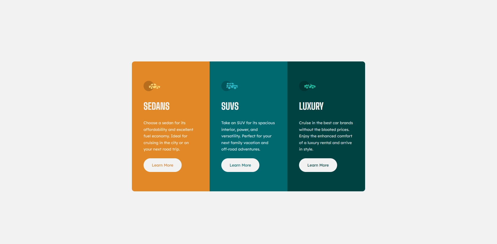

# Frontend Mentor - 3-column preview card component solution

This is a solution to the [3-column preview card component challenge on Frontend Mentor](https://www.frontendmentor.io/challenges/3column-preview-card-component-pH92eAR2-). Frontend Mentor challenges help you improve your coding skills by building realistic projects.

## Table of contents

- [Overview](#overview)
  - [The challenge](#the-challenge)
  - [Screenshot](#screenshot)
  - [Links](#links)
- [My process](#my-process)
  - [Built with](#built-with)
  - [What I learned](#what-i-learned)
  - [Continued development](#continued-development)
- [Author](#author)

## Overview

### The challenge

Users should be able to:

- View the optimal layout depending on their device's screen size
- See hover states for interactive elements

### Screenshot



### Links

- Solution URL: [Frontend Mentor Solution](https://www.frontendmentor.io/solutions/3column-preview-card-component-solution)
- Live Site URL: [Live Demo](https://juanfeoru.github.io/3-column-preview-card-component/)

## My process

### Built with

- Semantic HTML5 markup
- CSS custom properties
- Flexbox
- CSS Grid
- Mobile-first workflow

### What I learned

I improved my understanding of **CSS Grid and Flexbox** to build responsive layouts.  
Also practiced using **CSS variables** for colors and applied **hover effects** to buttons.

Here’s a small CSS snippet I’m proud of:

```css
.card {
  border-radius: 12px 12px 0 0;
  overflow: hidden;
}
```

### Continued development

I’d like to continue improving at:

- Perfecting responsive layouts
- Mastering CSS Grid and Flexbox combinations
- Writing cleaner, scalable CSS with BEM methodology

## Author

- Frontend Mentor - @juanfeoru
- GitHub - juanfeoru
